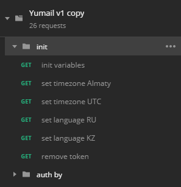
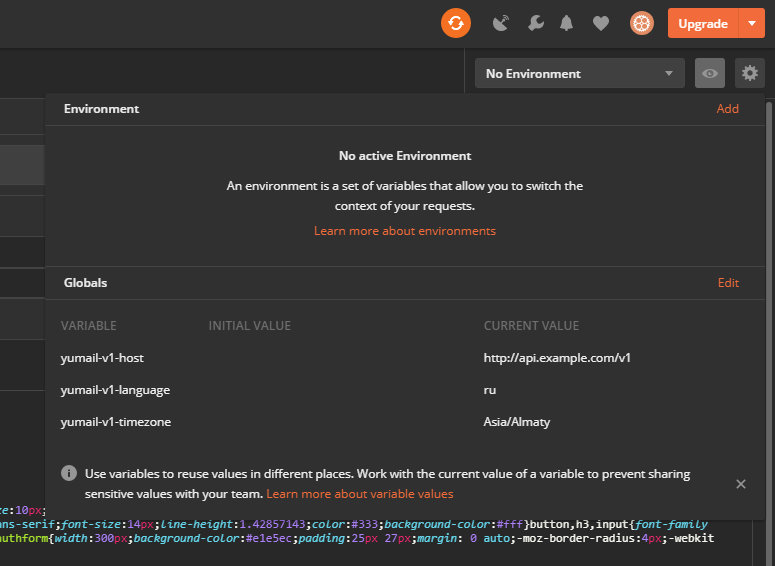

# Импорт коллекции в постман

После импорта, запускаем закладку `init/init variables`.

Эта закладка инициализирует глобальные переменные.

В результате, получаем 3 переменные:

Так же, в папке `init` есть закладки для смены языка и временной зоны.

Ссылка на закладках в этой папаке не играет никакой роли, 
ибо важен только скрипт.

Токен и локализация подставляются из переменых в каждом запросе.

Для авторизации достаточно только сделать запрос из папки `auth by`, заетм сделать нужный вам запрос.
